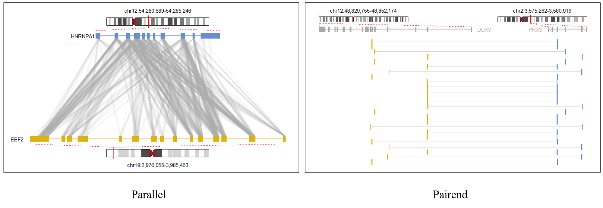

# gginteract
**gginteract** (Pairend reads interaction visualization with customizable ggplot object) is an in-house visualization tool for pairend reads interaction visualization.
These "pairend reads" can indirectly suggest the molecules interaction with next generation high throughput RNA-seq method (methods include MARGI, MARIO, PPI etc).
This package is specifically designed to present two molecules interaction in two fashions.

These fashions trying to capture the R1 and R2 mapping details in a condensed way.

These plots are achieved by aggregating the building blocks generated by gginteract packages, they are:
- ideograms
- gene annotaion tracks
- parallel pairend skeleton
- pairend horizontal skeleton
- text and marks

## Motivation
Existing solutions ([gviz](https://bioconductor.riken.jp/packages/3.0/bioc/html/Gviz.html), [ggbio](http://bioconductor.org/packages/release/bioc/html/ggbio.html)) 
for merging multifacet genome annotation (eg, ideogram or transcript annotation) using a *track stack* strategy, where each object occupys a track and different tracks stacked vertically share the same horizontal coordinates.
However, these tools fail to offer a flexible way to manipulate details of the tracks. For example it could be difficult to:
* Draw ideograms at random positions while control their width and height.
* Add other customizable information on existing track sharing the same coordinate. (eg. a zoom-in view, a gene name list of a gene dense region highlighted on an ideogram).


## Design philosophy
gginteract build every object on top of ggplot2 buildings to ensure that every building blocks of the plot is a ggplot layer, which means
you could add any other layers on top of the sckeleton exported from gginteract package. 

To ensure users could easily aquire the accurate position of the skeleton, each skeleton object is an S4 object with location details store in their slots.

## Installation
Install ggplot R pakcage from github. 

```
$ R
> library(devtools)
> install_github("irenexzwen/gginteract")
```

## Basic Usage
### 1. Required input data
To generate interaction plot, at least four inputs are required:

first two are gene annotation file, at least first three columns are needed (_chr name, exon start, exon end_). :
- `GENE1_anno` Dataframe, a bed file format dataframe for gene1. each row represents an exon with _chr, start, end_.
- `GENE2_anno` Dataframe, a bed file format dataframe for gene2. each row represents an exon with _chr, start, end_.

Next, reads information in bed format. At least first four columns are needed (_chr name, read start, read end, read name_). : 
- `Read1` Dataframe, a bed file format dataframe for Read1 (first end) bed file.
- `Read2` Dataframe, a bed file format dataframe for Read2 (second end) bed file.

Example data could be checked with:
```R
$R
> library(gginteract)
> data("R1","R2","GENE1_anno","GENE2_anno")
```
### 2. Parallel interaction plot
To generate a parallel interaction plot, you could simply use one function:
```R
$R
> data("R1","R2","GENE1_anno","GENE2_anno")
> para <- gginteract::parallel_plot(GENE1_anno = GENE1_anno,
                                  GENE2_anno = GENE2_anno,
                                  R1 = R1,
                                  R2 = R2,
                                  genename1 = "DDX23",
                                  genename2 = "RPS7")
> para
```


### 3. Pairend interaction plot
To generate a parallel interaction plot, you could simply use one function:
```R
$R
> data("R1","R2","GENE1_anno","GENE2_anno")
> pair <- gginteract::pairend_plot(GENE1_anno = GENE1_anno,
                                   GENE2_anno = GENE2_anno,
                                   R1 = R1,
                                   R2 = R2,
                                   genename1 = "DDX23",
                                   genename2 = "RPS7")
> pair
```


:neutral_face: **Notice!** We suggest use pairend interact plot fashion when the reads pair less than < 40 to avoid pixel collision.   
If you have more than 40 read pairs to show, please switch to the parallel style.

## Building blocks details:
The above functions are highly integrated and easy to use. However, the following details of each building blocks might be helpful if you want to create your own customized plot. 
### 1. Ideogram 
In gginteract you could create an ideogram ggplot object using the following code. You need to specify the genome you're using and sub chromosome you're looking for. This function rewrite the ideogram object in [ggbio](http://bioconductor.org/packages/release/bioc/html/ggbio.html)). 
```R
$R
> ?create_ideo                            # the function description
> ideo <- create_ideo(genome = "hg38",
                      chr = "chr4",
                      ideo.width = 400)  
> ggplot() + ideo@geom_ideobody                  
```
`create_ideo()` also allows you to move the ideogram object from the (0,0) with parameters `ydrift` and `xdrift`. You could also change the width and height ratio by reset `whratio=`. For example, you could make up a "[Bagua map](https://en.wikipedia.org/wiki/Bagua)" or a polarized "Bagua map" using the following code.  

```R
$R
> width_list <- c(400,150,150,400)
> height <- 25
> xdrifts <- c(0, 0, 250,0)
> ydrifts <- c(90, 60, 60, 30)
> geom <- list()
> for(i in 1:4){
               chrn <- paste0("chr",i)
               k <- create_ideo(chr = chrn, 
                                ideo.width = width_list[i],
                                ideo.height = height,
                                xdrift = xdrifts[i],
                                ydrift = ydrifts[i])
>              geom <- c(geom,k@geom_ideobody)}
> ggplot()+geom
> ggplot()+geom+coord_polar()
```
 
### 2. Parallel skeleton
The skeleton of parallel style interaction plot could be generate with the `parallel_inter` function:
```R
$R
> k <- parallel_inter(GENE1_anno = GENE1_anno,
                      GENE2_anno = GENE2_anno,
                      R1 = R1,
                      R2 = R2)
> ggplot()+k@geom_para
```

`parallel_inter` will create a `para` class instance. Often use `geom_para` slot to show the plot. Other slots of object k include:
- **k@genetop / k@genebot**: gene_anno class object to store meta information about the two genes.
```R
> str(k@genetop)
Formal class 'gene_anno' [package "gginteract"] with 8 slots
  ..@ name      : chr ""
  ..@ chr_num   : chr "2"
  ..@ chr       : chr "chr2"
  ..@ chromstart: int 3575262
  ..@ chromend  : int 3580919
  ..@ genelen   : int 5657
  ..@ center    : num 2828
  ..@ anno      :'data.frame':	7 obs. of  7 variables:
  .. ..$ chr   : chr [1:7] "chr2" "chr2" "chr2" "chr2" ...
  .. ..$ start : int [1:7] 3575262 3575591 3575816 3576486 3577709 3580109 3580804
  .. ..$ end   : int [1:7] 3575350 3575684 3575888 3576630 3577774 3580260 3580919
  .. ..$ NA    : chr [1:7] "exon_0" "exon_1" "exon_2" "exon_3" ...
  .. ..$ NA.1  : chr [1:7] "+" "+" "+" "+" ...
  .. ..$ yvalue: num [1:7] 0 0 0 0 0 0 0
  .. ..$ height: num [1:7] 374 374 374 374 374 ...
 ```
 - **coordinates information**
 

### 2. Pairend skeleton
The skeleton of pairend style interaction plot could be generate with the `pairend_inter` function:
```R
$R
pair <- pairend_plot(GENE1_anno = GENE1_anno,
                     GENE2_anno = GENE2_anno,
                     R1 = R1,
                     R2 = R2)
pair
```
This pairend skeleton object follows the same logic as para object. More details could be access using `str(pair)`. 
